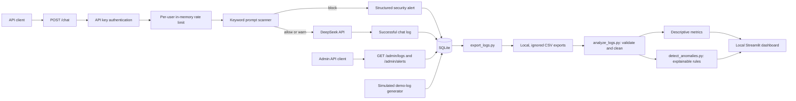
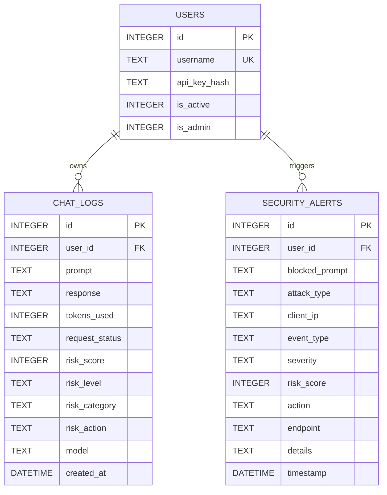

# Architecture and ERD

This is a local, single-instance LLM security gateway prototype. The diagrams describe the code in this repository, not a hardened production deployment.

## Request and analytics flow

The dashboard reads aggregate and user-level metrics, not raw prompts, responses, or IP addresses. It has no authentication and must remain local-only. The exported CSV files can contain sensitive content and are excluded from Git and Docker builds.

## SQLite entity relationship diagram

`init_db.py` creates these tables and adds newer columns to older local databases. The `api_key_hash` field is **currently populated and compared as plaintext**, despite its name. Do not interpret the name as a completed hashing control.

## Boundaries and limitations

- `chat_logs` represents successful provider calls. `security_alerts` represents blocked prompts. Missing/invalid API keys, rate-limit rejections, and provider failures are not counted by the current CSV analytics pipeline.
- The anomaly detector is rule-based. A flag is a lead for review, not proof of an attack.
- The Compose configuration binds both web ports to `127.0.0.1` and is intended for local demonstration only. It does not add HTTPS, dashboard authentication, distributed rate limiting, or production-safe key provisioning.
